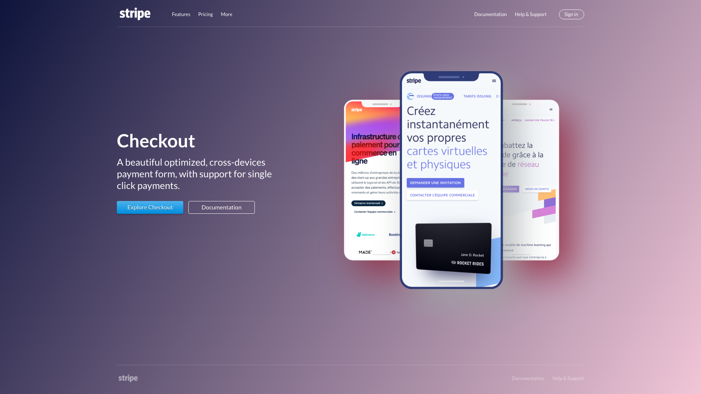

# Smartphone

Couleurs :

```
White: #ffffff
Dark opacity 30% : rgba(0, 0, 0, 0.3)
Gray opacity 50% : rgba(233, 233, 233, 0.5)
Blue : #0E143C
Blue light : #179de9
Blue dark : #00507c
Pink light : #F1C6D7
Red opacity 50% : rgba(255, 0, 0, 0.5)
```

Police de caractères : Lato


## Preview



